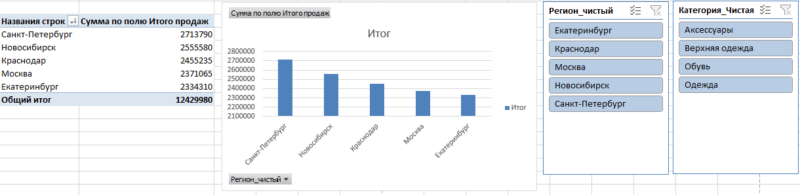

# Проект: Очистка данных CRM и построение бизнес-отчета в MS Excel

## 📌 Описание проекта
В данном проекте я выступила в роли независимого дата-аналитика. Цель проекта — провести полный цикл ETL (извлечение, очистка, трансформация и загрузка) для "грязной" выгрузки из CRM-системы розничной сети магазинов одежды (1400+ транзакций) и предоставить руководству чистые метрики продаж.

📂 **Материалы проекта для сравнения:**
* [Исходные "грязные" данные из CRM (Raw Data)](raw_crm_sales_data.xlsx) — данные до очистки (содержат дубликаты, скрытые пробелы, ошибки регистров и сломанные форматы).
* [Финальный очищенный отчет (Cleaned Report)](retail_sales_analysis_project.xlsx) — итоговый файл с примененными формулами, умными таблицами, сводными таблицами и дашбордом.

## 🛠 Какие проблемы в данных были успешно решены:
* **Дубликаты:** Выявлено и удалено 34 полностью дублирующихся заказа, завышавших общую выручку.
* **Поврежденные даты:** Удалены транзакции без дат. Строки с текстовым форматом и некорректными разделителями (`-`) принудительно переведены в системный формат дат `ДД.ММ.ГГГГ` через инструмент *«Текст по столбцам»*.
* **Текстовый "мусор":** Столбцы с категориями и наименованиями товаров очищены от невидимых скрытых пробелов с помощью формулы `=СЖПРОБЕЛЫ()`.
* **Маски артикулов:** Восстановлен единый стандарт артикулов (добавлен дефис после 3-го символа) с помощью текстовой склейки: `=ЛЕВСИМВ() & "-" & ПРАВСИМВ()`.
* **Аномалии в количестве:** Исключены технические ошибки выгрузки (заказы с количеством `0`). Отрицательные значения корректно сохранены как возвраты.
* **Номера телефонов:** Номера клиентов очищены от скобок, пробелов и дефисов через `Ctrl+H`. С помощью комплексной логической формулы `=ЕСЛИ()` все номера приведены к единому текстовому стандарту (старт с `7`), а пустые значения заменены на заглушку *"Нет телефона"*.
* **Регистр городов:** Исправлена проблема разного регистра (например, *санкт-петербург* и *Санкт-Петербург*), искажавшая общую аналитику по регионам. Использована функция `=ПРОПНАЧ()`.

## ⚙️ Технологический стек и подходы
* Архитектура данных переведена на **«Умные таблицы» (Excel Tables)** для динамического автоматического обновления.
* Построена **Сводная таблица (Pivot Table)** для агрегации бизнес-метрик.
* Реализован интерактивный дашборд с использованием **Срезов (Slicers)** для фильтрации данных на лету.

## 📊 Ключевые инсайты для бизнеса:
1. **Общая чистая выручка сети** (с учетом вычета возвратов) составила: **12 429 980 руб.**
2. **Топ-категория по продажам:** Верхняя одежда.
3. **Самый прибыльный регион:** Санкт-Петербург (финальная точная выручка: **2 213 790 руб.**).

## 📈 Визуализация дашборда

---
*Файл с решением и формулами доступен в репозитории: `retail_sales_analysis_project.xlsx`*
